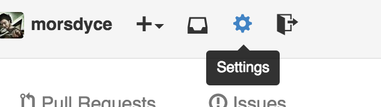
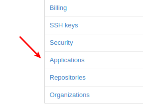
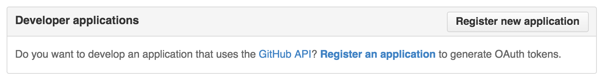
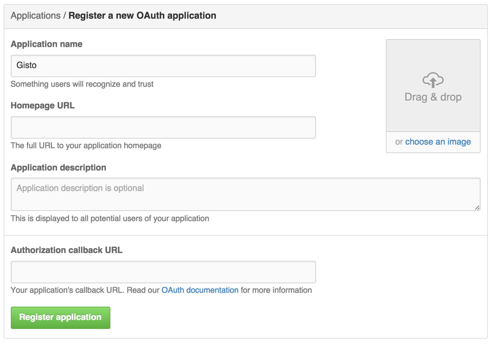
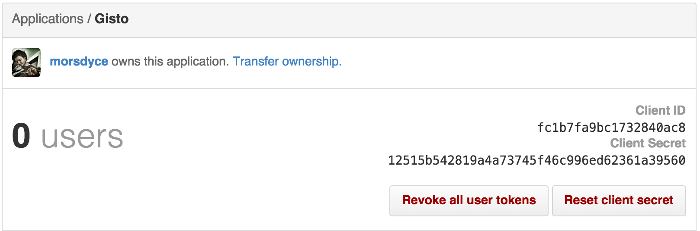

---

layout: "post"
title: "Gisto enterprise mode"
description: ""
post_title: "All you need to know about working with Gisto on GitHub Enterprise"
author: "Gisto team"
date: "2015-03-23"
path: "/blog/gisto-enterprise-mode"

---

In the past few months we've been working hard on the next major release of Gisto which come with a variety of cool features.
This time we want to focus on a major feature that we've added this release. GitHub Enterprise support.

<!--more-->

For those of you who would love to save snippets of your work but could not do so due to company regulations, or would simply
like to have these snippets available to your co-workers outside of public GitHub, this is for you.

You can now connect to your private GitHub Enterprise using Gisto.

Enterprise mode in Gisto allows connecting to your GitHub Enterprise (on-premise) instead of public GitHub.

Gisto works the same as it did until now except for a small subset of features that do not make sense on GitHub Enterprise.

## How can I use it?

When you open Gisto you will notice you will have a GitHub Enterprise toggle button, this is where you can choose to connect to
either public GitHub or your Enterprise instance.

When turning on GitHub Enterprise for the first time you will automatically be redirected to the enterprise settings page.
We ask for a few details so we can connect to your GitHub Instance.

- API Url - Your Enterprise api URL usually /api/v3 after your instance url which you use to access your Enterprise instance.
- Client ID
- Client Secret

Client ID and Client Secret can be acquired by creating an application in your GitHub Enterprise account settings page.

Click on Applications on the left sidebar

Under the Developer Applications click Register new application

In the following screen fill the application name as Gisto

Homepage URL and Authorization callback URL fields may be anything so you can just insert something like http://test.com

Once you created the application you should see the Client ID and Client Secret like in the following screenshot

> **Important Note:** You can share your Client ID and Client Secret with other members of your organization, please note that to allow
notifications being sent only on your organization we had to differentiate between organizations based on the Client ID.

This means that if you want to share a gist with another co-worker you should use the same Client ID.

## Sharing and notifications under a private notifications server

Currently, all notifications are handled by our servers, the only things we actually send are your username, client id, gist Id and gist
description.

If you do not want this data shared across the public internet or have no access to internet from your workstation you can run
the notifications server in premise and connect to that server.

> You can see all the detailed instructions on how to get the notifications server up and running at the [Documentation](/documentation) section.

